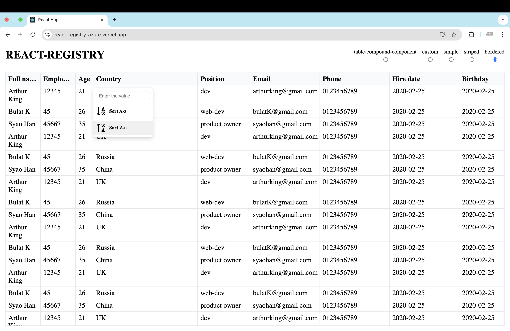

# React Registry

A lightweight, fully typed React component for building powerful data tables — with sorting, filtering, and user-friendly UI out of the box.

[**→ Live Demo**](https://react-registry-azure.vercel.app/)



## ✨ Features


- ✅ **Sorting** — sort data via header popup
- ✅ **Filtering** — configure filters via header popup
- ✅ **Fully typed** — TypeScript support included
- ✅ **Minimum dependencies** — no heavy UI libraries
- ✅ **Easy to customize** — clean, modular code
- ✅ **Two usage modes**:
    - `Registry` — smart component (ready to use)
    - `Table` — compound UI components (full control)
- ✅ **Utility hooks**: `useTableSort`, `useTableFilter` for custom logic

## 🚀 Quick Start

Install:
```bash
npm install react-registry
```
Basic usage (**Registry**):
```typescript jsx
import { Registry } from 'react-registry';

const DATA = [
    { fullName: 'Harry Potter', employeeNumber: 1, age: 18 }
];

const HEADERS = [
    { key: 'fullName', width: 'calc(50% - 30px)', label: 'Full name' },
    { key: 'employeeNumber', width: 'calc(50% - 30px)', label: 'Employee number' },
    { key: 'age', width: '50px', label: 'Age' },
];

function App() {
    return (
        <Registry
            data={DATA}
            headers={HEADERS}
            variant="bordered"
            sortable={true}
            filterable={true}
        />
    );
}
```
_💡 For full control, use the Table compound component and utility hooks (see docs)._


## 📦 What’s Included
#### Components:
- **Registry** — smart table with built-in sorting & filtering
- **Table** — low-level compound component (**Table.Header**, **Table.Body**, **Table.Row**, etc.)
- **Dropdown** — utility for popups (**Dropdown.Popup**, **Dropdown.Toggle**, etc.)

#### Hooks:
- **useTableFilter** - manage sorting state
- **useTableSort** - manage filtering logic

## Advanced Usage
### Custom header rendering (with sort indicators)

Override the default header to show sort direction symbols:

```typescript jsx
import { DATA, HEADERS } from './constants';
import { Registry, SortDirection, Table } from 'react-registry';
import s from './styles.module.scss';

const getSortSymbol = (sortDir: SortDirection) => {
    switch (sortDir) {
    case 'asc':
        return '↓';
    case 'desc':
        return '↑';
    }

    return '';
};

export const CustomRegistry = () => {
    return (
        <Registry
            data={DATA}
            headers={HEADERS}
            variant={'bordered'}
            sortable={true}
            filterable={false}
            className={s.customRegistry}
            renderHeaderCell={(props) => {
                return (
                    <Table.HeaderCell
                        index={props.index}
                        width={props.header.width}
                        onClick={() => props.setSort(props.header.key)}
                    >
                        {props.header.label}
                        {getSortSymbol(props.sortDirection)}
                    </Table.HeaderCell>
                );
            }}
        />
    );
};
```
_💡renderHeaderCell gives you full control over header rendering while keeping sorting logic managed by Registry._

### Fully custom table with compound components

Build your own table layout using low-level components:

```typescript jsx
import { Table } from 'react-registry';
import { DATA, HEADERS } from './constants';
import s from './styles.module.scss';
import { useTableSort } from './table-sort';

function App() {
    const { setSort, sortedData } = useTableSort(DATA);
    return (
        <Table variant={'striped'}>
            <Table.Header className={s.header}>
                <Table.HeaderCell index={-1} width={'70px'} className={s.indexCell}>
                    index
                </Table.HeaderCell>
                {HEADERS.map(({ key, width }, colIndex) => (
                    <Table.HeaderCell
                        key={key}
                        width={width}
                        index={colIndex}
                        onClick={() => setSort(key)}
                    >
                        {key}
                    </Table.HeaderCell>
                ))}
            </Table.Header>
            <Table.Body>
                {sortedData.map((row, rowIndex) => (
                    <Table.Row key={row.id} index={rowIndex} className={s.row}>
                        <Table.Cell
                            rowIndex={rowIndex}
                            colIndex={-1}
                            className={s.indexCell}
                        >
                            {rowIndex}
                        </Table.Cell>
                        {HEADERS.map(({ key }, colIndex) => (
                            <Table.Cell
                                key={key}
                                colIndex={colIndex}
                                rowIndex={rowIndex}
                            >
                                {row[key as keyof typeof row]}
                            </Table.Cell>
                        ))}
                    </Table.Row>
                ))}
            </Table.Body>
        </Table>
    );
}

```

## 🌐 Live Demo
See it in action: https://react-registry-azure.vercel.app/

## 📄 License
MIT © Kiyamov Bulat
